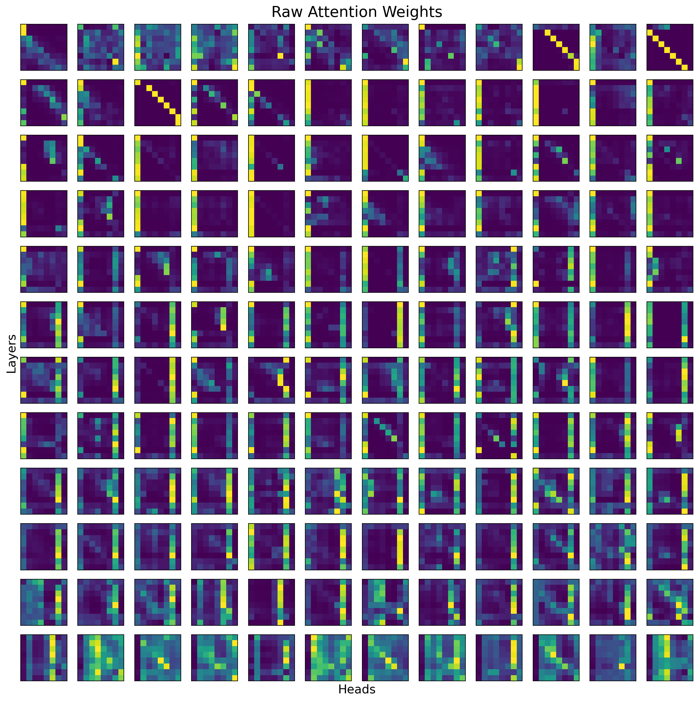
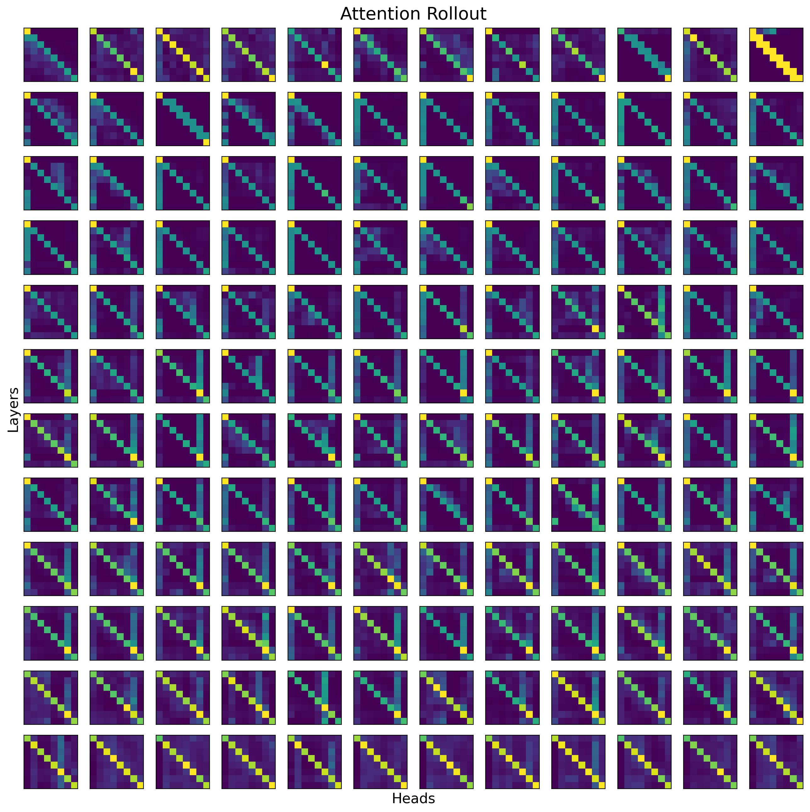
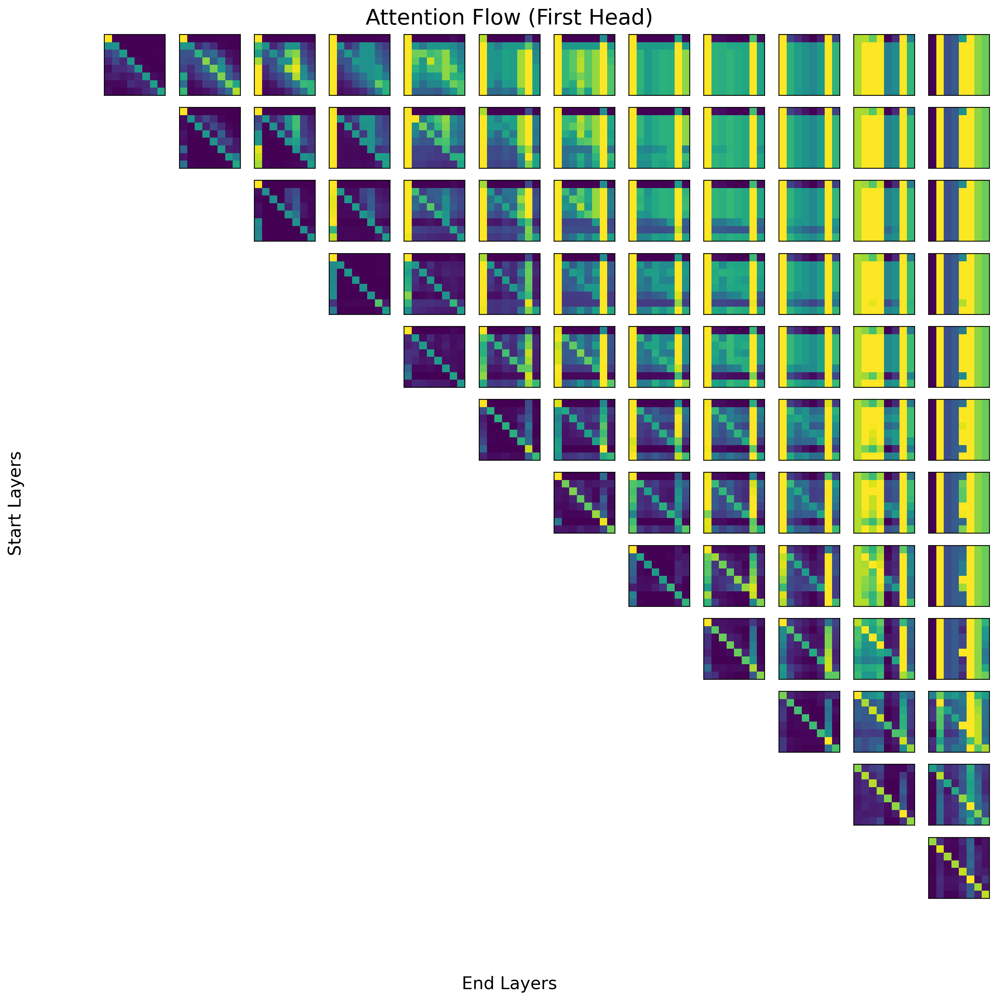

# Quantifying Attention Flow in Transformers (Replication)

## Introduction

This is a minimal replication of attention rollout and attention flow in the ACl 2020 paper [Quantifying Attention Flow in Transformers](https://aclanthology.org/2020.acl-main.385/).

## Results

The code has been tested on a single sentence with a SimCSE model. The results are visualized below.

